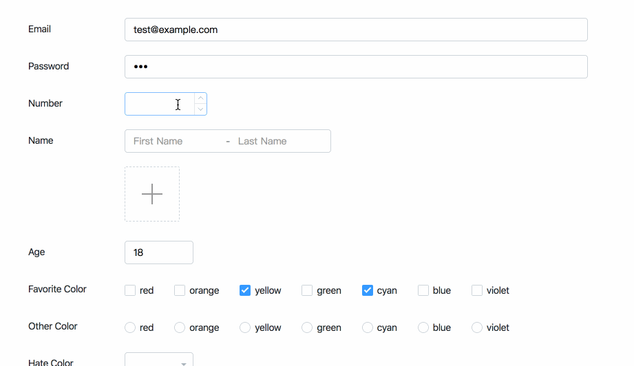
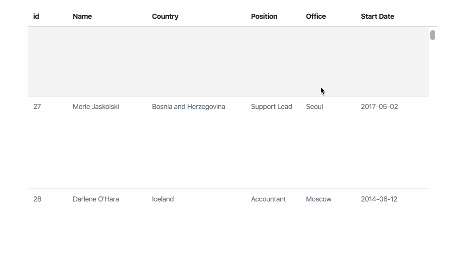

[English](./README.md) | 简体中文

<p align="center">
  
</p>

<p align="center">
一个更加『轻量』和『快速』的基于<a href="https://facebook.github.io/react">React</a>的桌面端组件库
</p>

<p align="center">
  <a href="https://www.npmjs.com/package/shineout"></a>
  <a href="https://www.npmjs.com/package/shineout"></a>
  <a href="https://david-dm.org/sheinsight/shineout"></a>
  
</p>

## ✨ 特性

 - 精巧且友好的 API
 - 开箱即用的高性能 React 组件
 - 接口永远向下兼容
 - 灵活的主题配置

<!-- [View docs here](https://sheinsight.github.io/shineout/) -->

## 🎯 依赖

```
React >= 16.0.0
React-dom >= 16.0.0
```

## 🖥 浏览器支持

| [](http://godban.github.io/browsers-support-badges/)</br>IE / Edge | [](http://godban.github.io/browsers-support-badges/)</br>Firefox | [](http://godban.github.io/browsers-support-badges/)</br>Chrome | [](http://godban.github.io/browsers-support-badges/)</br>Safari | [](http://godban.github.io/browsers-support-badges/)</br>Opera | [](http://godban.github.io/browsers-support-badges/)</br>Electron |
| --------- | --------- | --------- | --------- | --------- | --------- |
| IE10, IE11, Edge| last 2 versions| last 2 versions| last 2 versions| last 2 versions| last 2 versions |

## 💡示例
  - [精简且智能的表单](https://shine.wiki/1.4.x/cn/components/Form#heading-01-base)
  
   

  - [ 10000 条数据的高性能表格](https://shine.wiki/1.4.x/cn/components/Table#heading-08-bigdata)
  
   

## 📦 安装

```bash
yarn add shineout
```
// or
```bash
npm install shineout
```

## ☁️  CDN

```html
<link rel="stylesheet" href="https://unpkg.com/shineout/dist/theme.default.css" />
<script crossorigin src="https://unpkg.com/shineout/dist/shineout.min.js"></script>
```

## 🔨   使用

```javascript
import { Button } from 'shineout'

<Button />
```

引入 css

```javascript
import 'shineout/dist/theme.default.css' // or 'shineout/dist/theme.antd.css'
```

## 🌍  国际化

文档地址 [i18n](https://shine.wiki/1.4.x/cn/components/GetStart#heading-2-I18N)

## 🔗 链接

- [首页](http://shine.wiki/)
- [组件](https://shine.wiki/1.4.x/cn/components/GetStart)
- [更新日志](https://shine.wiki/1.4.x/cn/documentation/1.x.x)
- [易用表单](https://shine.wiki/1.4.x/cn/components/Form#heading-01-base)
- [性能表格](https://shine.wiki/1.4.x/cn/components/Table#heading-08-bigdata)
- [CodeSandbox 模板](https://codesandbox.io/s/delicate-http-y3duk)

## ⌨️ 开发

本地克隆:

```bash
$ git clone git@github.com:ant-design/ant-design.git
$ cd ant-design
$ yarn
$ yarn start
```

访问 http://localhost:3000

## 📜 开源许可
[MIT](./LICENSE)