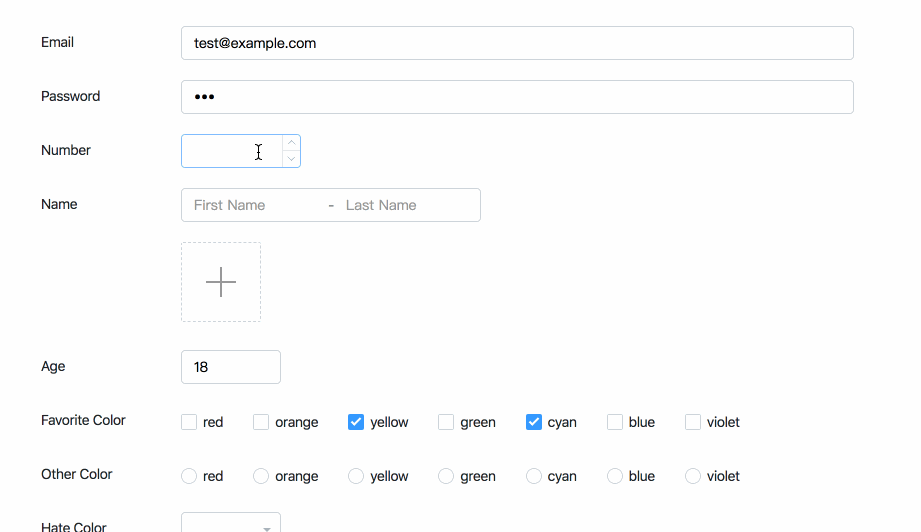
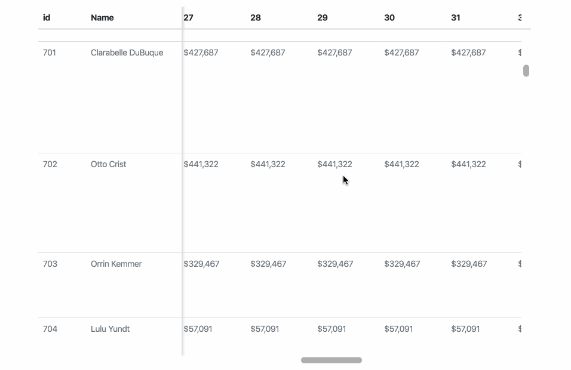

English | [简体中文](./README-zh_CN.md)

<p align="center">
  
</p>

<p align="center">
  A components library for <a href="https://facebook.github.io/react">React</a>
</p>

<p align="center">
  <a href="https://www.npmjs.com/package/shineout"></a>
  <a href="https://www.npmjs.com/package/shineout"></a>
  <a href="https://david-dm.org/sheinsight/shineout"></a>
  
</p>

## ✨ Features

 - A concise and friendly API
 - A set of high-performance React components out of the box.
 - Always backward compatible
 - Flexible theme customization

<!-- [View docs here](https://sheinsight.github.io/shineout/) -->

## 🛠️ Requirements

```
react >= 16.0.0
react-dom >= 16.0.0
```

## 🖥 Browsers support

| [](http://godban.github.io/browsers-support-badges/)</br>IE / Edge | [](http://godban.github.io/browsers-support-badges/)</br>Firefox | [](http://godban.github.io/browsers-support-badges/)</br>Chrome | [](http://godban.github.io/browsers-support-badges/)</br>Safari | [](http://godban.github.io/browsers-support-badges/)</br>Opera | [](http://godban.github.io/browsers-support-badges/)</br>Electron |
| --------- | --------- | --------- | --------- | --------- | --------- |
| IE10, IE11, Edge| last 2 versions| last 2 versions| last 2 versions| last 2 versions| last 2 versions |

## 🔍 Examples

  - [Concise And Intelligent Form](https://shine.wiki/1.4.x/en/components/Form#heading-01-base)
  
   [](https://shine.wiki/1.4.x/en/components/Form#heading-01-base)

  - [Performance Table With 10000 Records](https://shine.wiki/1.4.x/en/components/Table#heading-08-bigdata)
  
   [](https://shine.wiki/1.4.x/en/components/Table#heading-08-bigdata)

## 📦 Installation

```bash
npm install shineout
```

```bash
yarn add shineout
```

```bash
pnpm add shineout
```

## ⚡ CDN

```html
<link rel="stylesheet" href="https://unpkg.com/shineout/dist/theme.default.css" />
<script crossorigin src="https://unpkg.com/shineout/dist/shineout.min.js"></script>
```

## 🔧 Usage

```tsx
import { Button } from 'shineout'

<Button>Click me</Button>
```

And import style manually:

```javascript
import 'shineout/dist/theme.default.css' // or 'shineout/dist/theme.antd.css'
```

## 🌐 Internationalization

See [i18n](https://shine.wiki/1.4.x/en/components/GetStart#heading-2-I18N)

## 🔗 Links

- [Home page](http://shine.wiki/)
- [Components](https://shine.wiki/1.4.x/en/components/GetStart)
- [Smart Form](https://shine.wiki/1.4.x/en/components/Form#heading-01-base)
- [Performance Table](https://shine.wiki/1.4.x/en/components/Table#heading-08-bigdata)
- [Shineout template](https://codesandbox.io/s/delicate-http-y3duk)

## 🚀 Development

clone locally:

```bash
$ git clone git@github.com:sheinsight/shineout.git
$ cd shineout
$ yarn
$ yarn start
```

Open your browser and visit http://localhost:3000

## 📄 LICENSE
[MIT](./LICENSE)